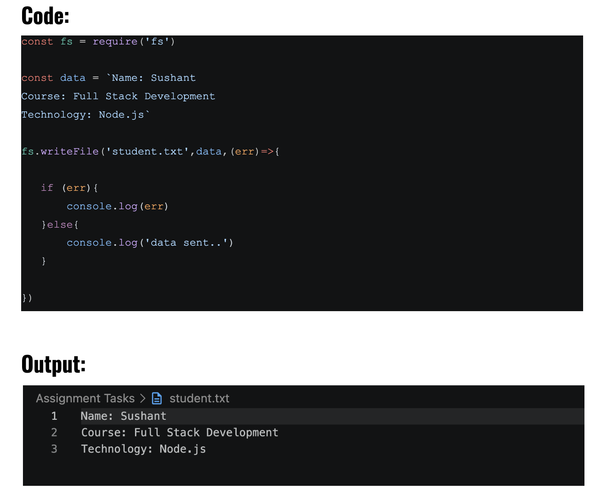
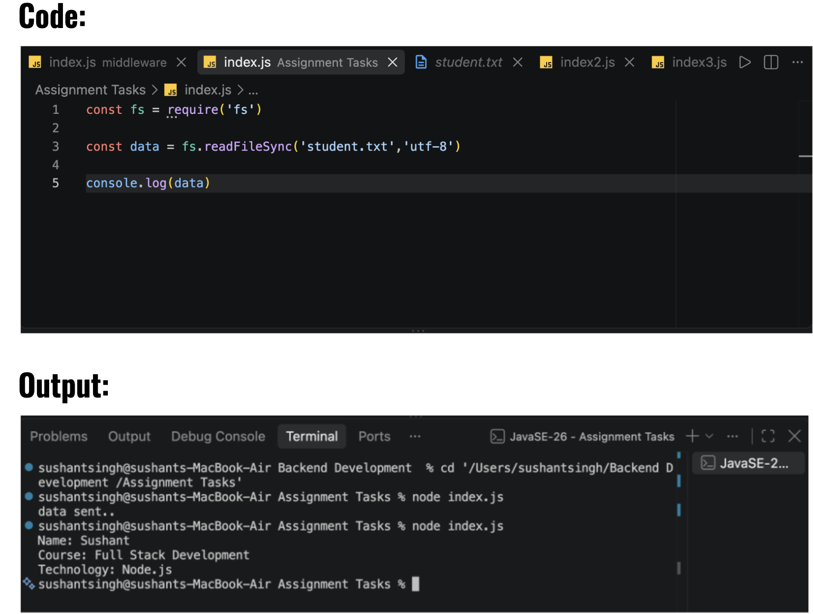
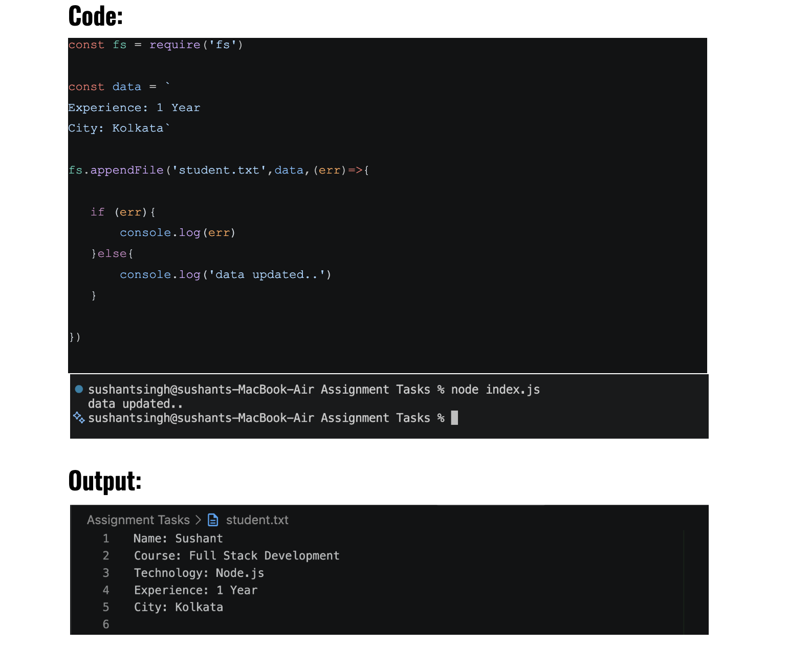
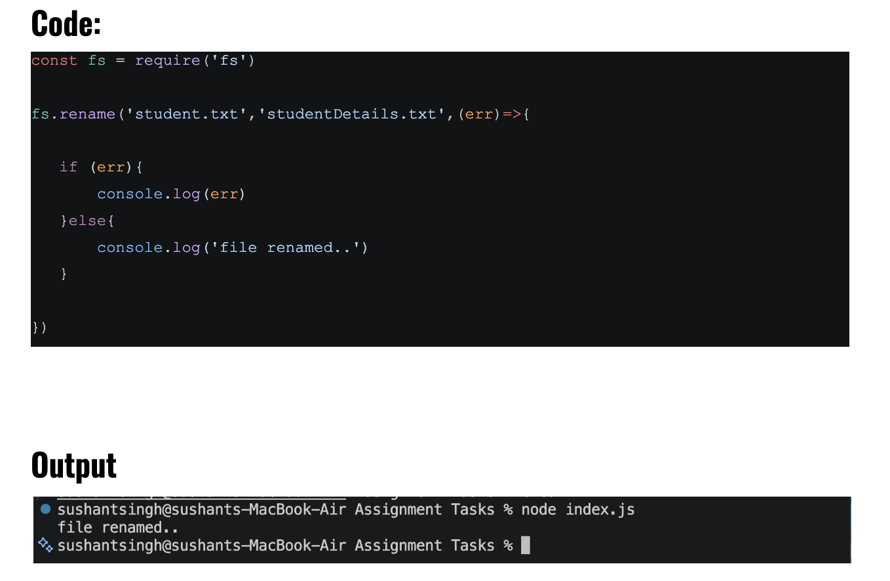
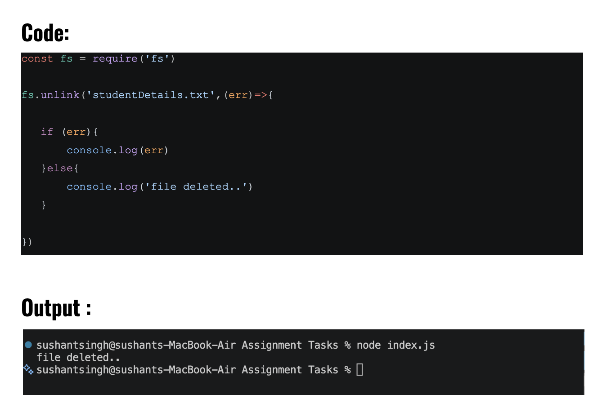

# Student Information File System Assignment

## Assignment Explanation

This assignment demonstrates basic file handling operations in Node.js using the `fs` module.

The following operations are performed:

1. Create a student information file using `fs.writeFile()`.
2. Read student information using `fs.readFileSync()`.
3. Update the file using `fs.appendFile()`.
4. Rename the file using `fs.rename()`.
5. Delete the file using `fs.unlink()`.

## Student Information

* Name: Sushant
* Course: Full Stack Development
* Technology: Node.js
* Experience: 1 Year
* City: Kolkata

## How to Run the Program

Open the project folder in VS Code and run the following command in the terminal:

```bash
node index.js
```

The program performs the required file operations and displays the result in the terminal.

## Output Screenshots

### Task 1: Create Student Information File



### Task 2: Read Student Information


### Task 3: Update Student Information



### Task 4: Manage File Name



### Task 5: Remove File


