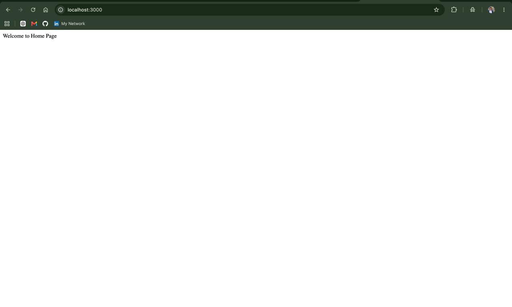
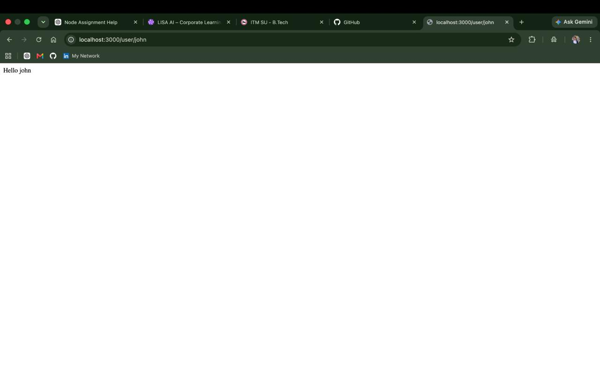
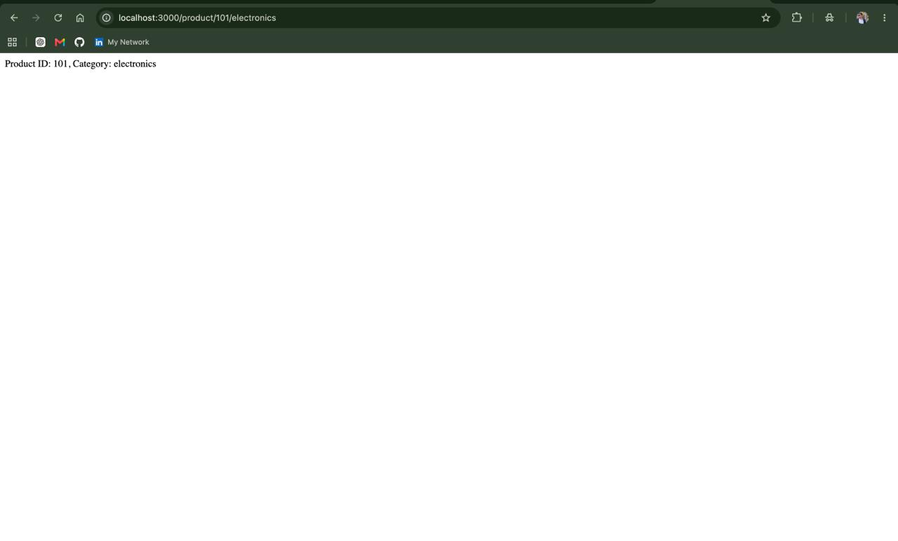
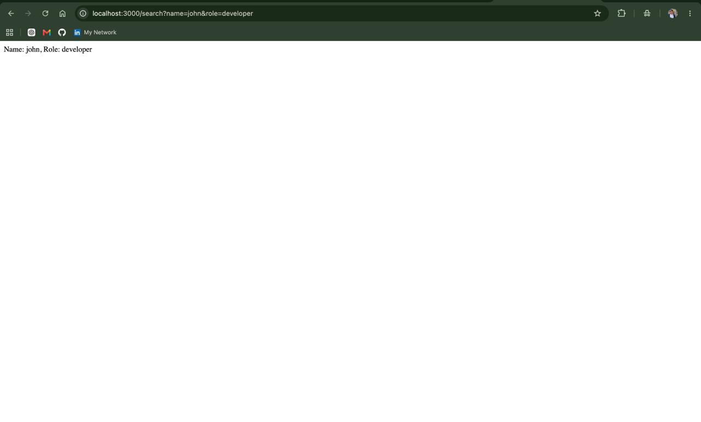
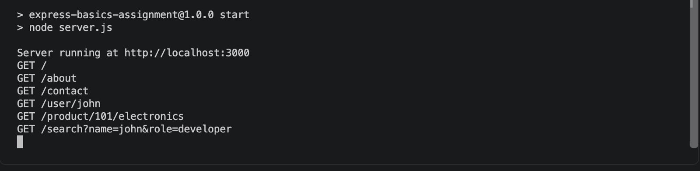

# Express Basics Assignment

## Assignment Overview

This assignment demonstrates the basic concepts of Express.js routing, including basic routes, dynamic route parameters, multiple route parameters, query parameters, and request-response logging.

## Technologies Used

- Node.js
- Express.js
- JavaScript
- Visual Studio Code

## Project Structure

```text
express-basics-assignment/
│
├── server.js
├── package.json
├── package-lock.json
└── README.md 

---

# Screenshots

## Task 1 - Basic Routes



## Task 2 - Route Parameter



## Task 3 - Multiple Route Parameters



## Task 4 - Query Parameters



## Task 5 - Request-Response Logging

